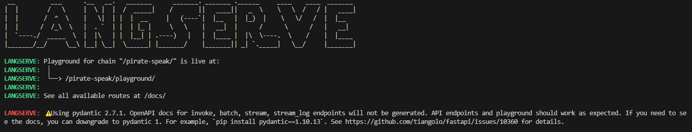
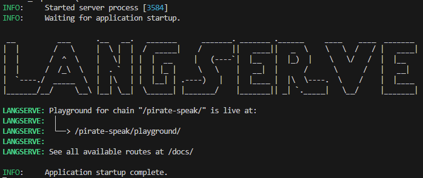
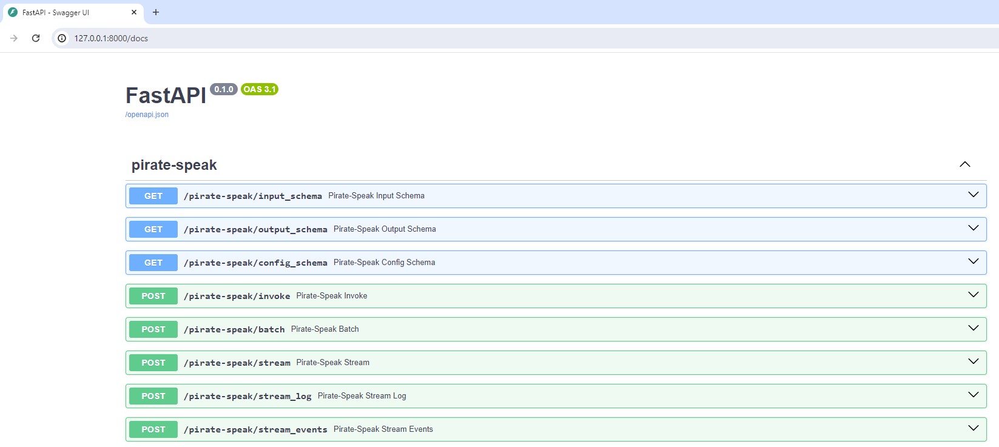
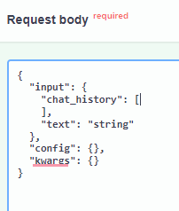
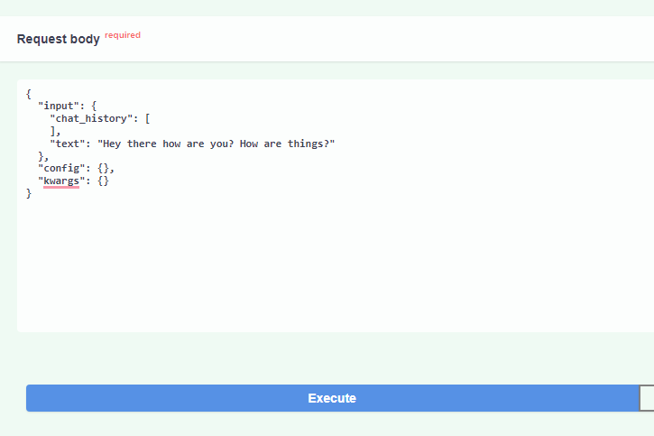
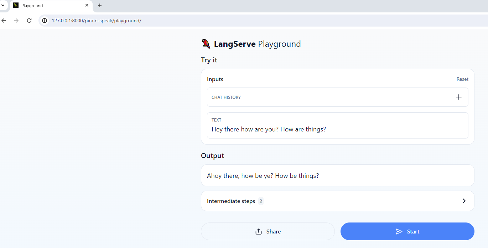
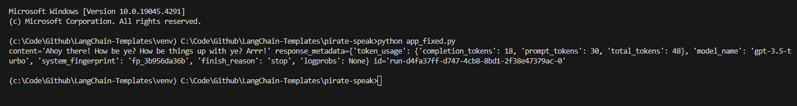
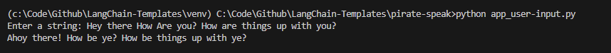
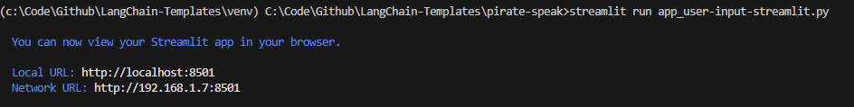
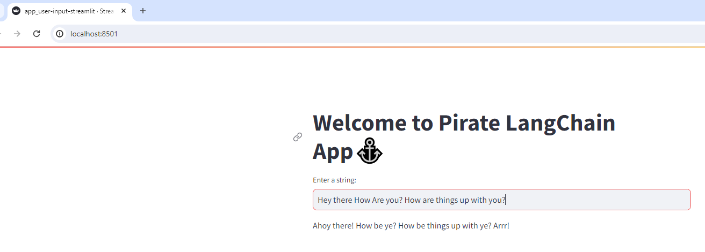

# This Repo explains an elaborate method of using LangChain Templates

## Setting up the Folder structure

### Create a folder LangChain-Templates

>I prefer to do this via windows browser
1. Create a master folder called "LangChain-Templates".
2. Create a sample "Readme.md" file in it.
3. Create a subfolder with the name of the package that you want to use e.g. "pirate-speak".
4. Create a .env file inside it.
5. Open vscode.
6. Open folder "LangChain-Templates" in vscode

### Create Conda environment

1. Right Click on the Readme.md and Open in new integrated terminal  (use cmd terminal).
2. Create a conda env

    `conda create -p venv python==3.10`

3. Activate the env

    `conda activate venv/`

### Install LangChain CLI

To use this package, you should first have the LangChain CLI installed:

`pip install -U langchain-cli`

You'll later need to load envs from .env file, so install python-dotenv package for it beforehand.

`pip install python-dotenv`

**At this point the master Conda Environment to support the use of Langchain Packages is ready!**

## Install the required LangChain package 

1. Go to the package subfolder

    `cd pirate-speak`

2. To create a new LangChain project and install this as the only package, you can do.

    `langchain app new my-app --package pirate-speak`

    If you want to add this to an existing project, you can just run:

    `langchain app add pirate-speak`

## Configure the package
1. Open server.py file in vscode editor

    Path:

    `..\LangChain-Templates\pirate-speak\my-app\app\server.py`

2. Add routes in the server.py

    And add the following code to your server.py file:

    ```python
    from pirate_speak.chain import chain as pirate_speak_chain
    add_routes(app, pirate_speak_chain, path="/pirate-speak")
    ```


3. Import the env variables into the server.py

    ```python
    import os
    from dotenv import load_dotenv
    load_dotenv()
    ```


# Configure Langsmith

Steps to create Langserve API key are at the end of this tutorial
1. Open a new integrated bash terminal
2. Go to  following folder using cd

    `LangChain-Templates/pirate-speak/my-app`
3. Export the envs require for LangServe

    `export LANGCHAIN_TRACING_V2=true`

    `export LANGCHAIN_API_KEY=<your-api-key>`

    `export LANGCHAIN_PROJECT=<your-project>  # if not specified, defaults to "default"`

4. If you are inside this directory, then you can spin up a LangServe instance directly by:

    `langchain serve`

5. You might see this error



6. To handle this install pydentic version 1.10.13 in the bash terminal itself

    `pip install pydantic==1.10.13`

7. Spin up LangServe again


    `langchain serve`
    
This will start the FastAPI app with a server is running locally at http://localhost:8000


8. Now you should see:




# Using the Fast API

We can see all templates at http://127.0.0.1:8000/docs



1. Press "POST" > Try it out"
2. Remove the chat hostry since we are not using it at this point.
3. Type your prompt in in place of "String"

    

4. Press "Execute"
    

5. You'lll see the response like:
    


# Using the PlayGround

2. We can access the playground at http://127.0.0.1:8000/pirate-speak/playground

Try it Out like This



# Accessing the template from code with fixed input embedded in form of a json:

To access the template using python code and create applications. We need to create apython file containing the implementation of our app.

Create a file app.py at path which is going to contain out application code.

`..\LangChain-Templates\pirate-speak\app.py`


## Accessing the template from code with fixed input embedded in a json:

```python
from langserve.client import RemoteRunnable

runnable = RemoteRunnable("http://localhost:8000/pirate-speak")

input_data= {
    "chat_history": [
    ],
    "text": "Hey there How Are you? How are things up with you?"
}

print(runnable.invoke(input_data))
```

### Invoke the python app




## Accessing the template with user input:

You could create a python app that utilizes the template and generate responses to user inputs

```python
import requests

def get_pirate_response(user_input):
    response=requests.post(
        "http://localhost:8000/pirate-speak/invoke",
        json={
                "input": {
                    "chat_history": [
                    ],
                    "text": user_input
                },
                "config": {},
                "kwargs": {}
                })
    return response.json()['output']['content']

user_input = input("Enter a string: ")

print(get_pirate_response(user_input))
```

### Invoke the python app


## Creating a streamlit app:

You could create a streamlit app having a UI utilizing the template and generate responses to user inputs

### Install streamlit in your conda environment:

`pip install streamlit`


```python
import requests
import streamlit as st


def get_pirate_response(user_input):
    response=requests.post(
        "http://localhost:8000/pirate-speak/invoke",
        json={
                "input": {
                    "chat_history": [
                    ],
                    "text": user_input
                },
                "config": {},
                "kwargs": {}
                })
    return response.json()['output']['content']

st.title("Welcome to Pirate LangChain App⚓")
user_input = st.text_input("Enter a string: ")
if user_input:
    response=get_pirate_response(user_input)
    st.write(response)
```

### Run the streamlit app:

`streamlit run app_user-input-streamlit.py`

The streamlit application would spinup



Try out a user input



## Process to create Langserve API key

1. Go to https://www.langchain.com/
2. Signin (Signup in case you do not have an account already)
3. You'll get redirected to https://smith.langchain.com/o/73f54c34-84e1-5516-a9cc-5d9ae836cbdd/settings
4. Go to Settings > API Keys > Create API Key
5. Put a suitable description
6. Press Create API Key

